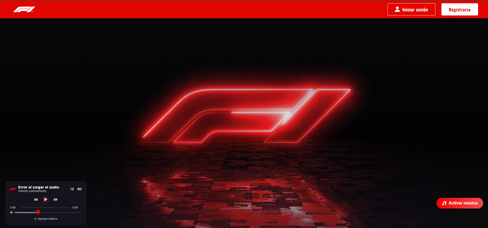
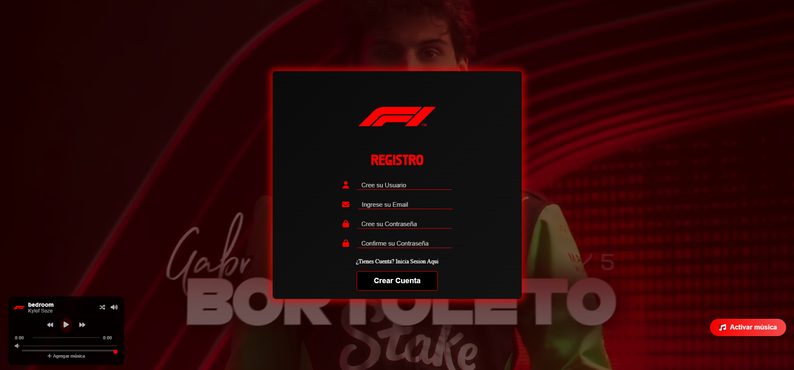
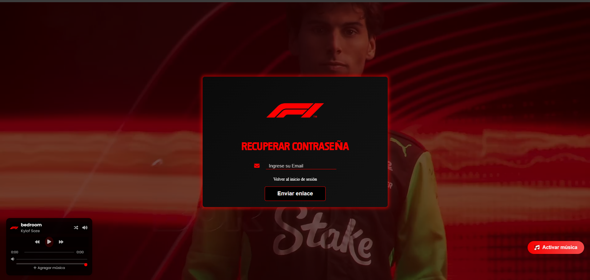
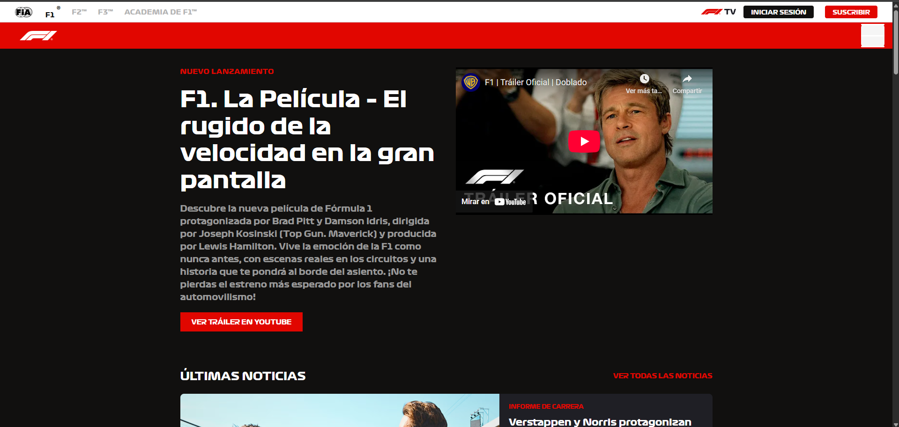
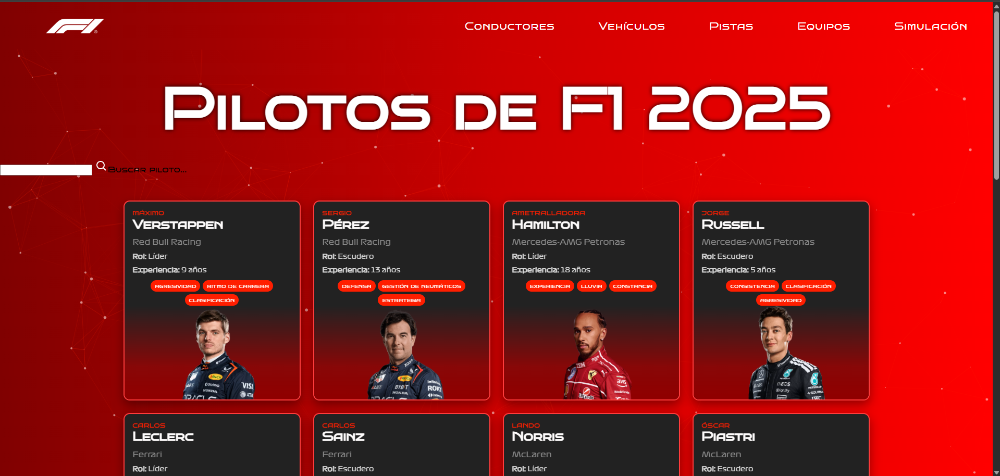
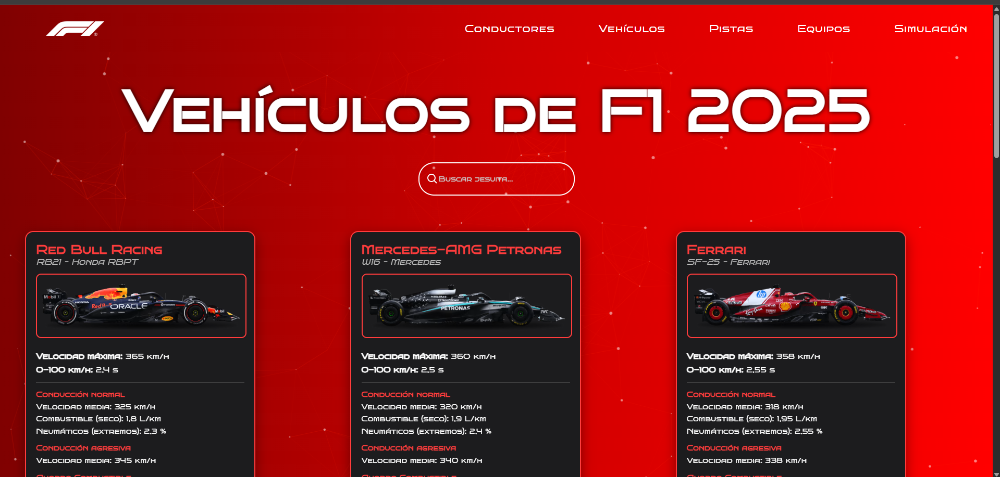
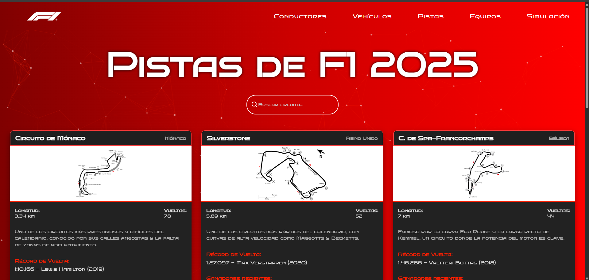
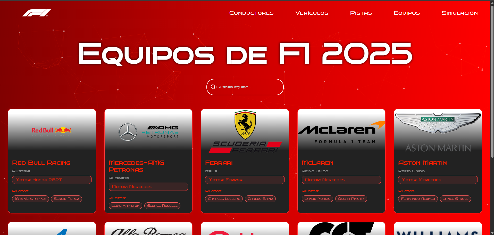

# 🏎️ F1 Simulación Web
<p align="center"> 
  
</p>

---

## 📝 Descripción del Proyecto

F1 Simulación Web es una aplicación interactiva que permite explorar el mundo de la Fórmula 1: pilotos, equipos, vehículos, pistas y simulaciones. El objetivo es ofrecer una experiencia visual moderna, educativa y atractiva, con navegación fluida y diseño responsive tanto en PC como en móvil.

---

## 📚 Aprendizajes Obtenidos

- Uso avanzado de **HTML5** y **CSS3** para interfaces responsivas y atractivas.
- Implementación de menús adaptativos (desktop y móvil) y animaciones.
- Gestión de usuarios con registro, login y almacenamiento en **localStorage**.
- Integración de recursos multimedia (audio, video, imágenes).
- Organización y reutilización de componentes visuales y estilos.
- Buenas prácticas de estructura de carpetas y documentación.

---

## 🔧 Tecnologías Utilizadas

- HTML5
- CSS3 (Flexbox, Grid, Media Queries, Animaciones)
- JavaScript (ES6+)
- LocalStorage para persistencia de usuarios
- Iconos y fuentes externas (FontAwesome, Google Fonts)

---

## 🗂️ Estructura del Proyecto

```
/ (raíz del proyecto)
│
├── src/
│   ├── assets/
│   │   ├── audio/           # Audios de fondo y efectos
│   │   ├── images/          # Imágenes y logos
│   │   └── video/           # Videos de fondo
│   ├── css/                 # Hojas de estilo (styles, variables, mediaqueries, etc.)
│   ├── js/                  # Scripts JS (login, signup, audio, navegación, etc.)
│   └── html/                # Páginas HTML principales (drivers, vehicles, tracks, teams, etc.)
│
├── README.md                # Documentación del proyecto
└── ...                      # Otros archivos de configuración
```

---

## 🌐 Publicación en GitHub Pages

El proyecto puede ser publicado fácilmente en GitHub Pages. Solo sube el contenido del repositorio y configura la rama principal como fuente de GitHub Pages.

🔗 **[Ver Aplicación en Vivo](https://TU-USUARIO.github.io/NOMBRE-DEL-REPO/)**

---

## ❓ Preguntas Frecuentes

**¿Cómo inicio sesión?**
> Puedes registrarte como nuevo usuario o usar las credenciales de prueba (admin o user). El sistema valida los datos y te redirige a la página principal.

**¿Puedo usar la app en móvil y PC?**
> Sí, el diseño es 100% responsive y el menú de navegación se adapta a cualquier dispositivo.

**¿Qué pasa si olvido mi contraseña?**
> Hay un enlace de recuperación en la pantalla de login.

**¿Cómo agrego música o videos?**
> Puedes cargar tus propios archivos de audio desde el reproductor integrado.

---

## 👨‍💻 Autor del Proyecto

| Nombre        | Info                                |
|---------------|-------------------------------------|
| 🧑 Daniel Santiago | Estudiante de Campuslands |
| 🎓 Formación      | Desarrollo Web y Frontend         |
| 💻 Enfoque        | HTML, CSS, JavaScript, UI/UX      |
| 📍 Ubicación      | Piedecuesta, Santander - Colombia |

---

## 🧩 Funcionalidades Destacadas

✔️ Registro e inicio de sesión de usuarios (con localStorage)
✔️ Navegación entre secciones de F1: Pilotos, Equipos, Vehículos, Pistas, Simulación
✔️ Menú responsive (desktop y móvil) con animación hamburguesa
✔️ Reproductor de audio integrado y personalizable
✔️ Diseño visual moderno, animaciones y efectos
✔️ Integración de videos y recursos multimedia
✔️ Experiencia de usuario fluida y atractiva

---

## 🧪 Código Destacado (Menú Responsive y Navegación)

```html
<!-- Menú de navegación responsive -->
<nav id="desktop-nav">
  <div class="logo"></div>
  <div>
    <ul class="nav-links">
      <li><a href="drivers.html">Drivers</a></li>
      <li><a href="vehicles.html">Vehicles</a></li>
      <li><a href="tracks.html">Tracks</a></li>
      <li><a href="teams.html">Teams</a></li>
      <li><a href="simulation.html">Simulation</a></li>
    </ul>
  </div>
</nav>
<nav id="hamburger-nav">
  <div class="logo"></div>
  <div class="hamburger-menu">
    <div class="hamburger-icon">
      <span></span>
      <span></span>
      <span></span>
    </div>
    <div class="menu-links">
      <ul>
        <li><a href="drivers.html">Drivers</a></li>
        <li><a href="vehicles.html">Vehicles</a></li>
        <li><a href="tracks.html">Tracks</a></li>
        <li><a href="teams.html">Teams</a></li>
        <li><a href="simulation.html">Simulation</a></li>
      </ul>
    </div>
  </div>
</nav>
<script>
  document.addEventListener('DOMContentLoaded', function() {
    const hamburgerIcon = document.querySelector('.hamburger-icon');
    const menuLinks = document.querySelector('.menu-links');
    hamburgerIcon.addEventListener('click', function() {
      menuLinks.classList.toggle('open');
    });
  });
</script>
```

---

## 💬 Conclusión

Este proyecto demuestra cómo se puede construir una experiencia web moderna, interactiva y educativa sobre la Fórmula 1 usando solo tecnologías web estándar. El enfoque en la usabilidad, el diseño responsive y la integración multimedia hacen de esta app una referencia para proyectos educativos y de portafolio.

---

---

## 💭 Filosofía Personal

> "El código no es solo lo que hago. Es lo que soy. Cada línea de código es una oportunidad para crear algo extraordinario y dejar una huella en el mundo digital." - Daniel Santiago

---


## 🎯 Entregable Final

Repositorio: [GitHub – Proyecto F1 Simulación](https://github.com/TU-USUARIO/NOMBRE-DEL-REPO)
Despliegue: [GitHub Pages – F1 Simulación](https://TU-USUARIO.github.io/NOMBRE-DEL-REPO/)

---

## 📞 Contacto y Redes

- 📧 Email: [vinascodaniel9@gmail.com](mailto:vinascodaniel9@gmail.com)
- 🐙 [GitHub](https://github.com/DanielSantiagoV)
- 🎵 [Spotify - Playlist de Programación](https://open.spotify.com/playlist/6a3d9qWLg1cOyMRWoqwr16)

---

## 📸 Capturas del Diseño

<p align="center">
  <b>Principal</b><br>
  
</p>

<p align="center">
  <b>Login</b><br>
  
</p>

<p align="center">
  <b>Registrarse</b><br>
  
</p>

<p align="center">
  <b>Olvidar Contraseña</b><br>
  
</p>

<p align="center">
  <b>Pagina Inicial</b><br>
  
</p>

<p align="center">
  <b>Drivers</b><br>
  
</p>

<p align="center">
  <b>Vehiculos</b><br>
  
</p>

<p align="center">
  <b>Tracks</b><br>
  
</p>

<p align="center">
  <b>Teams</b><br>
  
</p>

## ✨ Características del Proyecto

- 🎨 Diseño moderno, visual y atractivo inspirado en la Fórmula 1
- 📱 100% responsive: experiencia perfecta en PC y móvil
- 🏁 Navegación fluida entre secciones y simulación interactiva
- 🔒 Registro e inicio de sesión seguro con localStorage
- 🎵 Reproductor de audio integrado y personalizable
- 🏎️ Integración de videos, imágenes y recursos multimedia
- 🧩 Código organizado, reutilizable y fácil de mantener
- 🚀 Listo para despliegue en GitHub Pages o cualquier hosting estático

---

## 📝 Licencia

Este proyecto está bajo la Licencia MIT.
Consulta el archivo [LICENSE](./LICENSE) para más detalles.

---

<p align="center">
  Desarrollado con ❤️ por Daniel Santiago Vinasco<br>
  🔥 <b><a href="https://github.com/DanielSantiagoV">Visita mi GitHub</a></b> 🚀
</p>

## 🛡️ Declaración Ética

Este proyecto fue desarrollado únicamente con fines educativos y de aprendizaje personal. No tiene ninguna intención de suplantar, copiar ni competir con la página oficial de la Fórmula 1 ni con ninguna de sus marcas registradas. Todos los recursos visuales, nombres y temáticas utilizados son empleados con el objetivo de practicar y demostrar habilidades de desarrollo web, diseño UI/UX y programación frontend.

Si eres parte de la organización oficial de la Fórmula 1 y consideras que algún contenido debe ser retirado o modificado, por favor contáctame y lo haré de inmediato.

---